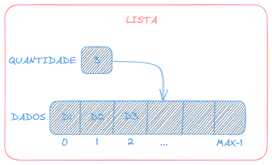

# Lista Linear Estática
> Tipo de lista onde o sucessor de um elemento ocupa 
a posiçao física seguinte do mesmo.
</img>

## Vantagens
- Acesso rápido e direto aos elementos.
- Tempo constante para acessar um elemento.

## Desvantagens
- Definição prévia do tamanho da lista.
- Dificultade de inserir e remover um elemento entre dois outros (é nescessário fazer deslocamento).

## Quando utilizar 
- Lista pequenas.
- Inserção e remoção são apenas no final da lista.
- Tamanho máximo for definido.
- A busca é a operação mais frequente.

## Operações 

- ### Operações de construção
    - Criar Lista
    - Destruir lista

- ### Operações de informações
    - Cheia
    - Vazia
    - Tamanho
    - Exibir a lista

- ### Operações de Manipulação
    - Inserir elemento no inicio
    - Inserir elemento em ordem 
    - Inserir elemento no fim

    - Remover elemento do inicio
    - Remover elemento por id
    - Remover elemento do fim

- ### Operações de Busca
    - Buscar elemento por id
    - Buscar elemento do indice

## Dados
Nesta lista vamos armazenar dados sobre pessoas. Para a estrutura deve armazenar, id, nome, idade e peso. Essas são as informações que armazenaremos sobre as pessoas.

- ### Operações de dados
    - Pegar informações
    - Visualizar informações
