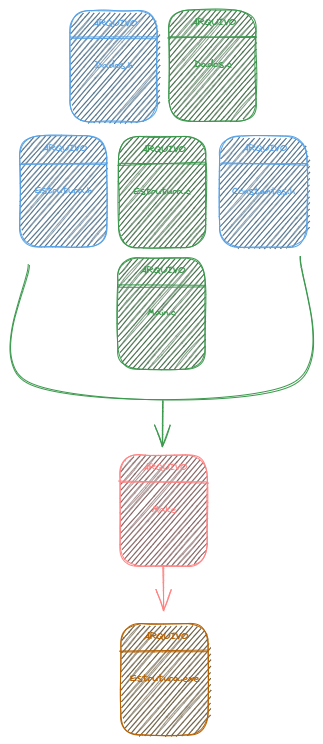

# Estrutura_de_Dados_I
 > É o ramo da computação que estuda os diversos mecanismos de organização de dados para atender aos diferentes requisitos de processamento.

Neste projeto vamos criar os varios tipos de estrutura de dado, usando a liguagem de programação C. A seguir um modelo de como procederemos com a compilação.

## Estrutura de Compilação
A estrutura de compilação em todas as estruturas seguirá o seguinte padrão. Os dados que seram armazenados na estrutura devem ser bem definidos, em seguida usadas pelas estruturas e pela a principal onde fica o menu.
</img>

### Dados
> Estes sao definidos previamente em cada estrutura que fizermos, logo podem ser diferentes de uma estrutura para outra. São apenas para exemplificar situações do mundo real.

__Exemplo__: Uma lista que guarda informações de **pessoas**.

### Estruturas
> Estas são definidas de acordo como estudaremos em cada caso. E são muitas em composição e variação.

__Exemplo__: 
1. Lista
2. Pilhas
3. Filas
4. Árvores
5. Grafos
6. ...

### Constantes
> Neste arquivo contem todas as constantes que sao utilizadas em cada projeto de estrutura.

### Main
> Neste arquivo vamos defimos um menu para fazer o uso das estruturas, podendo este ser diferente para cada uma delas.

### Make
> Neste contem todas as regras de compilação para gerar o executavel.

### Executavel
> O programa propriamente pronto para uso.

Cada estrutura tem a sua documentação. É só ler.